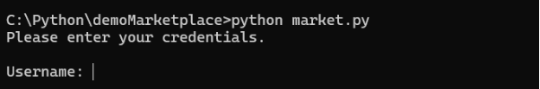
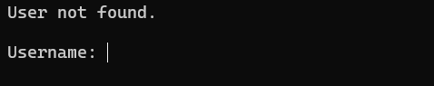
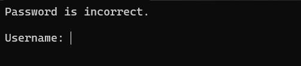
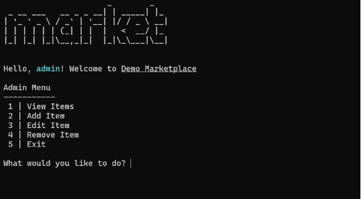

# ONLINE MARKETPLACE
## *Console Application - Python*
### Description:
The project is a console application designed to function as a marketplace allowing users to view and purchase items 
and admins to add, remove and edit items. All data is stored in JSON files which are accessed and edited by the 
application.

Since, this is a CLI-based application, it does support images or videos.

***NOTE: This project requires external libraries to function.***

---

### **Requirements:**
- pyfiglet - [https://pypi.org/project/pyfiglet/](https://pypi.org/project/pyfiglet/)
- rich - [https://pypi.org/project/rich/](https://pypi.org/project/rich/)
- tabulate - [https://pypi.org/project/tabulate/](https://pypi.org/project/tabulate/)

---

### **Installation:**
1. Clone the repository: `git clone https://github.com/mishrasumitranjan/demoMarketplace`
2. Navigate to the project directory: `cd demoMarketplace`
3. Install the required libraries using pip: `pip install -r requirements.txt`
4. Run the application by executing the main script: `python main.py`

---

# **How it works**:
As mentioned earlier app works in the console. Launching the application asks the user for a username and password.

The entire functionality of the application is enclosed in a class called **`Market`**. On initialization, it calls a 
function to get the username and password. The username and password are validated based on the data obtained from 
**`users.json`** file.

An error message is displayed if the user is not found. A different error messages displayed if the user is found 
but the password is incorrect.

## The Admin Side:

Logging in using the admin account displays the following page:

The welcome message displayed at the top is only displayed when the user logs in. Any action performed by the user 
will cause the message to disappear. This space is used to display various messages and errors that can happen 
inside the application. This is achieved by using a dictionary called `flags` where each flag is set to 1 to display 
the message or error, and then reset back to 0.

The actions displayed in the screenshot above are available to admins. A number can be input to perform the action. 
Giving an invalid option will result is an error being displayed in the space mentioned previously.

1. ### **View Items**
    Displays the available items in a tree format divided by item category.

    
    
    The information of items is stored in the file **`stock.json`**. When the class is initialized, the contents of the 
   file are fetched and stored in an attribute. Changes to this attribute are later written to the file to keep 
   track of changes.

2. ### **Add Item**
    Items can be added to the catalogue using this menu.

    

    Using a category not previously in the catalogue triggers a confirmation question.

    

    After this the user is asked for product details like name, details, rating, and price. The rating and price 
   columns have an error checking in place to ensure that incorrect or invalid values are not added. After this the 
   entered information is displayed and the user is asked to confirm if this is the product they want to add.
    
    

    I want to confirmation the item will be added to the desired category, the user will be returned to the admin 
   menu and a short message will be displayed stating that the process was completed.

    

3. ### **Edit Item**
    An existing product can be edited by selecting this option. Similar to the Add Item option it will first present 
   the user with a list of categories from which to choose. A list of items belonging to the selected category will 
   be presented in a table format which contains the name, rating, and price of the products.

    

    Once an item is selected list of its current details will appear asking the user what they want to edit.

    

    After user enters the details the product will be edited. The user will be taken back to the admin menu and a 
   message will be displayed stating the detail of the product which has been edited.

    

4. ### **Remove Item**
    This option is used to remove items from the catalogue. Like the previous two options it starts with giving the 
   user a list of categories to select from. After a category is selected a list of products belong to that category 
   is presented. Selecting an item here removes the item. If the category becomes empty, then the category is 
   removed and the message is displayed.

    

## The Consumer Side:
Logging in using a user account displays the following page:

It functions in a similar way to the admin side, but the options available to consumers are different.

1. ### **Browse Categories**
   This option generates a list of available categories.

   

   User can select any of the applicable categories to look at the products within those categories.

   

   After selecting one of the available products the user would be asked about the quantity of the product they would 
   want to buy. After entering the amount the product will be added to user’s cart and the user would be redirected 
   to the main menu with a message confirming that the product has been added to cart.

   

2. ### **View Cart**
   Here the user can view their current cart and its related actions. If the cart is empty the user is redirected 
   back to the main menu and a message is displayed stating that the cart is empty.

   

   If the cart is not empty the cart will be displayed as a table, with the names of the items, the quantities, the 
   total of each item and a grand total at the bottom of the table. Selecting the remove option gives the user the 
   option to select an item and then select the quantity of items to remove. This can be used to reduce the number 
   of items in the cart or remove the item.

   

   After the item is removed, the user is redirected back to the View Cart page with a message displaying the number 
   of items removed.

   

   Selecting the Checkout option gives the user the option to select one of the available payment methods. On 
   selecting one of the payment methods the cart is cleared the and the program exits.

   

   Selecting the Clear Cart option asks the user for confirmation and then clears the entire cart if the user 
   responds with a yes.

   

   The user Is redirected back to the main menu with a message stating that the cart has been cleared.

   

   The cart is unique for each user and is saved in the **`users.json`** file. As such the cart can be accessed between 
   different sessions as long as user logs in with the same account.

   

3. ### **Exit**
   

   The exit option can be used to exit the application. It exits the application with the "Thank You" message. The 
   same function is used during the checkout process as well. If the cart is not empty then the user will be asked 
   for confirmation before exiting.

---

***NOTE:*** Most windows that require the user to choose an option, but do not have an option to exit, have a hidden 
functionality where entering upper case ‘X’ will allow the user to exit the application. This functionality was 
added for debug purposes.

